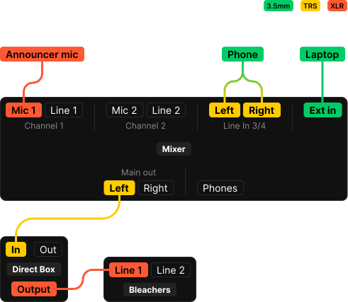

+++
title= "Basketball"
+++

# About
Running a home basketball game is fairly simple—but there are still a few things you should probably know.

# What you need

### Mixer briefcase (audio)
Inside there should be at least:

- Alesis portable mixer board
	- AC power adapter
- XLR wired microphone
- TRS cable
- 3.5mm aux cable
- XLR cable
- Lightning to 3.5mm adapter
- TRS to 3.5mm adapter

### Laptop briefcase (video)
Less to keep track of here:

- Dell laptop (Windows 10, Core i3)
	- AC power adapter

### Other

- Direct Box / "DI" (should already be plugged into bleachers)

# Audio

1. Place mixer on table
2. Ensure that the DI is plugged into `Line 1` port in the bleachers. It should already be plugged in via XLR.
3. Run the TRS cable from the `Main out (left)` on the mixer to the `In` (left side) on the DI.
4. Plug in your microphone via the XLR you brought to the `MIC 1` XLR port on the mixer.

## Diagram

# Video

1. Plug in and turn on laptop.
2. Plug in the HDMI cable that comes out of the display-board.
3. Start GamePresenter on the laptop—ensure that you have the proper graphics selected.
4. Adverts / player intro videos should display at the top-left corner of your screen.
	- Don't put a window or mouse cursor into this region—the audience can see it.