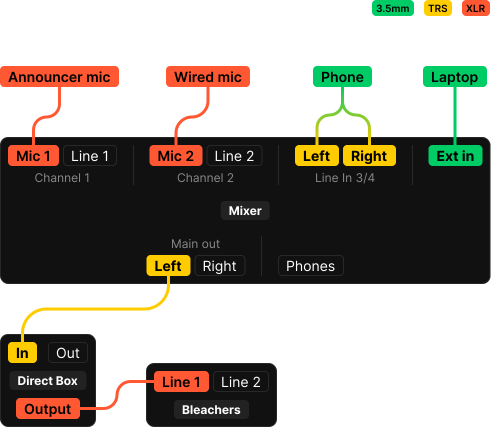

+++
title= "Basketball"
+++

Running a home basketball game is fairly simple—but there are still a few things you should probably know.

## What you need
- **Mixer briefcase (audio)—** should contain at least:
	- Alesis portable mixer board
		- AC power adapter
	- Shure push-to-talk XLR microphone (Announcer)
	- Shure SM58 handheld XLR microphone (Halftime)
	- Very long TRS cable
	- 3.5mm aux cable
	- Very long XLR cable
	- Lightning to 3.5mm adapter
- **Laptop briefcase (video)**
	- Dell laptop (Windows 10, Core i3)
		- AC power adapter
- **Direct box / "DI"** Should be plugged into bleachers when packing up.
	- 3.5mm to dual TRS

## Setting up audio

1. Check that the direct box (DI) is plugged into *Line 1* port in the bleachers. It should already be plugged in via XLR.
	- The 3.5mm to dual TRS cable should be plugged into the DI box as well.
2. Unplug the 3.5mm to dual TRS cable from the DI box and set it aside.
3. Run the TRS cable from the *Main out (left)* jack on the mixer to the *In* jack (left side) on the DI.
	- Route this cable through the right-most cable management hole on the scorer's table.
4. Plug in the announcer microphone via XLR to the *MIC 1* XLR port on the mixer.
	- Place the mic on the left side of the scorer's table—routing the cable behind the blue scoring controller.
5. Take the 3.5mm to split TRS cable that you set aside earlier and plug it into the *LINE IN 3/4* jacks on the mixer. The other end can be plugged into whatever is providing music.
6. Now that cabling is done, you can finally plug in the mixer and turn on the two power switches on the rear. (mixer power and phantom power)

> ### Boys varsity game?
> You'll want to set up the halftime microphone.
> 1. Using the long XLR cable, plug in the handheld Shure SM58 microphone into the *MIC 2* XLR port on the mixer.
> 		- Take care to route the XLR cable through the right-most cable management hole on the scorer's cable. This is to prevent anybody from snagging the mixer while using the mic.

> ### ⚠️ Not working?
> Ensure the following things are set:
> 1. The power [switch](/prod/basketball/amp.jpg) for the amps are turned on in the storage room
> 2. The [breaker](/prod/basketball/breaker.jpg) for the sound system is flipped on (should be labeled in the breaker box)
> 3. The [volume knobs](/prod/basketball/volume.jpg) for the PA are set to the penciled-in marks (you might need a custodian to unlock this for you)

## Setting up video

1. Ensure that the scoring table is plugged into power
2. Plug in and turn on laptop.
3. Plug in the HDMI cable that comes out of the display-board.
4. Start GamePresenter on the laptop—ensure that you have the proper set of videos selected.

The adverts / player intro videos should display at the top-left corner of your screen.

> ### GamePresenter information
> Before you run a game, it's recommended that you explore the GamePresenter software a little bit to get familiar with quickly doing things.
> Should you need to look through the documentation, you can find the manuals [here](#).
>
> *Ensure that you start GamePresenter **AFTER** plugging in the HDMI cord.*

## Running the game

Great! Everything should be wired and working.

### Pre-game

As players warm up, it's likely that you'll be handed a smartphone to play a player's playlist through. If so, plug it into the *LINE 3/4* channel, and set the phone's volume to 100%. You'll want to then move the volume fader for the music channel up or down until the signal is peaking at around +6 dB on the meters. Otherwise—plug in the laptop to the *LINE 3/4* instead and play the *Basketball* playlist.

Once the music is set, ask the cheerleaders for their halftime song and the starting timestamp. If they give you one, remember this for halftime.

Right before the game starts (around 1:00 on the clock), fade down the music. If the laptop isn't already plugged in to the *LINE 3/4* channel on the mixer, plug it in now. The announcer should begin making announcements and (if a varsity game) do player introductions. 

For the player introductions, there is a set of videos on the laptop. Each video corresponds to a player name and number. As the announcer calls the names for the varsity team, click on their name on the laptop. The visiting team doesn't have videos, so don't feel alarmed if you don't recognize the first set of names.

Once player introductions are done, you can begin rolling the ads by hitting the play button in the software.

> #### Boys varsity game?
> The laptop should be plugged into *LINE 3/4* and have the Star Spangled Banner ready to play on Spotify. Wait until everyone stands for the National Anthem and hit play.
> Mute the laptop once the song ends.

### In-game

During the game, your job is to ensure that the announcer's mic has a good volume setting and to play player/crowd prompts when certain things happen. The way to stay on-top of this is by actively watching the game, listening to the crowd's response, and *listening to the announcer* (IMPORTANT). Even if you know nothing about basketball, the announcer will call out important events like three-pointers or player substitutions. All you need to do is click on the relevant crowd prompt or player video for each event.

For example, should a player substitution happen for a player who wasn't on the starting group of players at the beginning of the game (you didn't play their video), play their video if they get substituted into the game. If a player makes a three-point shot, you can click the three pointer crowd prompt video.

Let the prompts run for only a few seconds before resuming the ads by clicking the play button again.

### Timeouts

During timeouts, play music from the football playlist. Fade out when cheer is cheering or when the announcer is speaking.

### Halftime

Same as the timeouts, I'll add instructions for boys varsity later.

When cheer runs onto the court and they settle down, play their song at their timestamp. Fade out when they run off.

### End of game

Do nothing—no music, nothing.

## Clean-up

Do everything in setup but backwards.

[TODO: Add basic information on using GamePresenter.](https://github.com/srfalcon5/wiki/issues/1)
